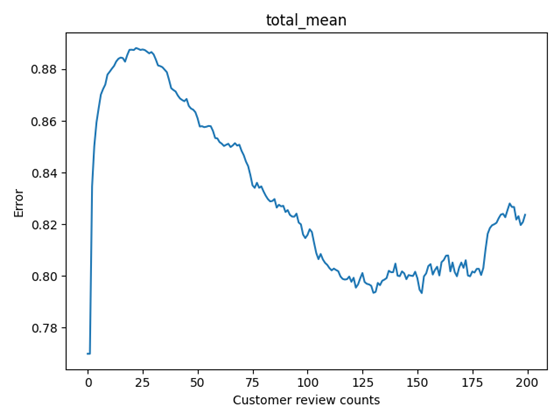

# About this repository
크롤링한 네이버 플레이스 DB와 장고를 기반으로 하는 맛집 추천 시스템입니다. 
 
http://211.109.199.30:8000 에서 사용해볼 수 있습니다.

# About details
2020년 4~5월 경에 크롤링한 DB를 사용하였으며,
 
이 과정에서 약 40만개의 음식점 DB 및 음식점의 리뷰들을 사용하여 모델을 학습하였습니다.
 
2020 국어 정보 처리 경진대회에 출품했던 ELECTRA 모델과 TabNet 모델을 사용하였습니다.
 
 
이 시스템은 카테고리나 라벨링 된 데이터를 사용하므로, 각 사용자의 음식점 평가 점수에 따라 개인화 된 맛집 추천 정보를 제공합니다.

# About errors

 
이 시스템을 사용하였을 때, 고객 당 평균적인 예상 점수 오차는 약 0.9점입니다.

